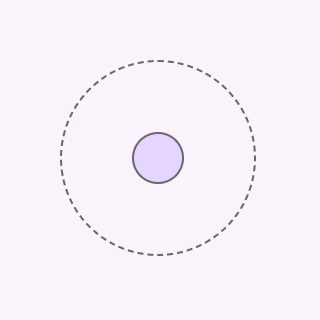
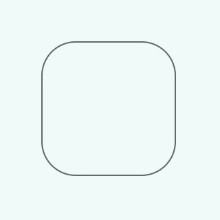

<!-- catalog-only-start --><!-- ---
name: Ripple
dirname: ripple
ssrOnly: true
-----><!-- catalog-only-end -->

<catalog-component-header image-align="start">
<catalog-component-header-title slot="title">

# Ripple

<!--*
# Document freshness: For more information, see go/fresh-source.
freshness: { owner: 'lizmitchell' reviewed: '2023-06-05' }
tag: 'docType:reference'
*-->

<!-- no-catalog-start -->

<!-- go/md-ripple -->

<!-- [TOC] -->

<!-- external-only-start -->
**This documentation is fully rendered on the
[Material Web catalog](https://material-web.dev/components/ripple/)<!-- {.external} -->**
<!-- external-only-end -->

<!-- no-catalog-end -->

Ripples are
[state layers](https://m3.material.io/foundations/interaction/states/state-layers)<!-- {.external} -->
used to communicate the status of a component or interactive element.

A state layer is a semi-transparent covering on an element that indicates its
state. A layer can be applied to an entire element or in a circular shape.

</catalog-component-header-title>


</catalog-component-header>

*   [Design article](https://m3.material.io/foundations/interaction/states/state-layers)
    <!-- {.external} -->
*   API Documentation (*coming soon*)
*   [Source code](https://github.com/material-components/material-web/tree/main/ripple)
    <!-- {.external} -->

<!-- catalog-only-start -->

<!--

## Interactive Demo



-->

<!-- catalog-only-end -->

## Usage

Ripples display on hover and press pointer interactions. They may be attached to
a control in one of three ways.

<!-- no-catalog-start -->


<!-- no-catalog-end -->
<!-- catalog-only-start -->

<!--

<div class="figure-wrapper">
  <figure
      title="A bounded ripple."
      aria-label="A container that displays a bounded ripple on interaction.">
    TODO: update figure
  </figure>
</div>

-->

<!-- catalog-only-end -->

1.  Attached to the parent element

    ```html
    <style>
      .container {
        position: relative;
      }
    </style>
    <button class="container">
      <md-ripple></md-ripple>
    </button>
    ```

1.  Attached to a referenced element

    ```html
    <style>
      .container {
        position: relative;
      }
    </style>
    <div class="container">
      <md-ripple for="control"></md-ripple>
      <input id="control">
    </div>
    ```

1.  Attached imperatively

    ```html
    <style>
      .container {
        position: relative;
      }
    </style>
    <div class="container">
      <md-ripple id="ripple"></md-ripple>
      <button id="ripple-control"></button>
    </div>
    <script>
      const ripple = document.querySelector('#ripple');
      const control = document.querySelector('#ripple-control');
      ripple.attach(control);
    </script>
    ```

> Note: ripples must be placed within a `position: relative` container.

### Unbounded

To create an unbounded circular ripple centered on an element, use the following styles.

```css
.container {
  display: grid;
  place-items: center;
  position: relative;
}

md-ripple.unbounded {
  border-radius: 50%;
  inset: unset;
  height: var(--state-layer-size);
  width: var(--state-layer-size);
}
```

<!-- no-catalog-start -->



<!-- no-catalog-end -->
<!-- catalog-only-start -->

<!--

<div class="figure-wrapper">
  <figure
      title="An unbounded ripple."
      aria-label="A circular container with an inner circle that displays an unbounded ripple around it on interaction.">
    TODO: update figure
  </figure>
</div>

-->

<!-- catalog-only-end -->

```html
<style>
  .container {
    border-radius: 50%;
    height: 32px;
    width: 32px;

    /* Needed for unbounded ripple */
    display: grid;
    place-items: center;
    position: relative;
  }

  md-ripple.unbounded {
    /* Needed for unbounded ripple */
    border-radius: 50%;
    inset: unset;
    height: 64px;
    width: 64px;
  }
</style>
<button class="container">
  <md-ripple class="unbounded"></md-ripple>
</button>
```

## Accessibility

Ripples are visual components and do not have assistive technology requirements.

## Theming

Ripples support [Material theming](../theming.md) and can be customized in terms
of color.

### Tokens

Token                    | Default value
------------------------ | ------------------------
`--md-ripple-hover-color` | `--md-sys-color-on-surface`
`--md-ripple-pressed-color` | `--md-sys-color-on-surface`

*   [All tokens](https://github.com/material-components/material-web/blob/main/tokens/_md-comp-ripple.scss)
    <!-- {.external} -->

### Example

<!-- no-catalog-start -->



<!-- no-catalog-end -->
<!-- catalog-only-start -->

<!--

<div class="figure-wrapper">
  <figure
      class="styled-example"
      title="Ripple theming example."
      aria-label="Image of a ripple with a different theme applied">
    TODO: update figure
  </figure>
</div>

-->
<!-- catalog-only-end -->

```html
<style>
:root {
  --md-sys-color-primary: #006A6A;
  --md-ripple-hover-color: var(--md-sys-color-primary);
  --md-ripple-pressed-color: var(--md-sys-color-primary);
}

.container {
  position: relative;
}
</style>
<button class="container">
  <md-ripple></md-ripple>
</button>
```
